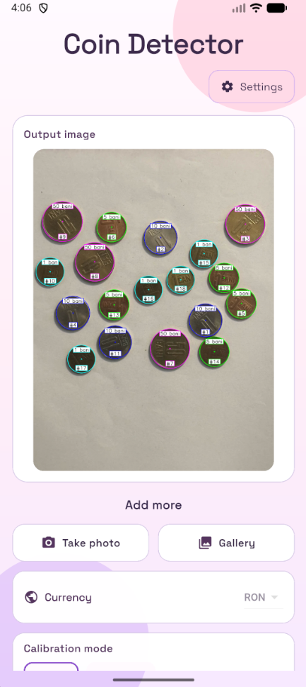
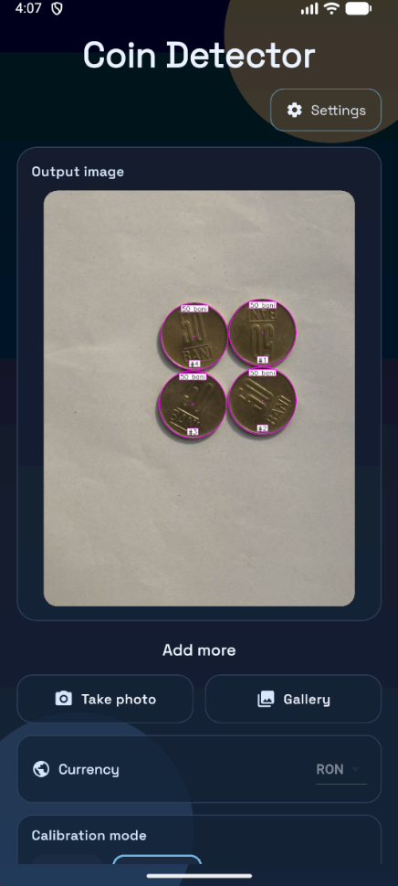
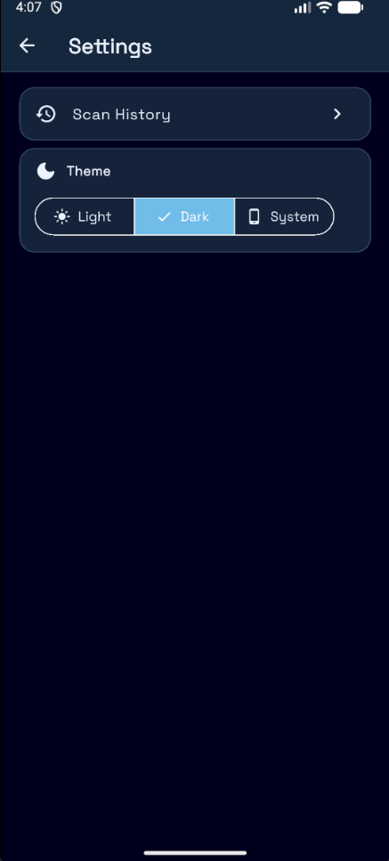
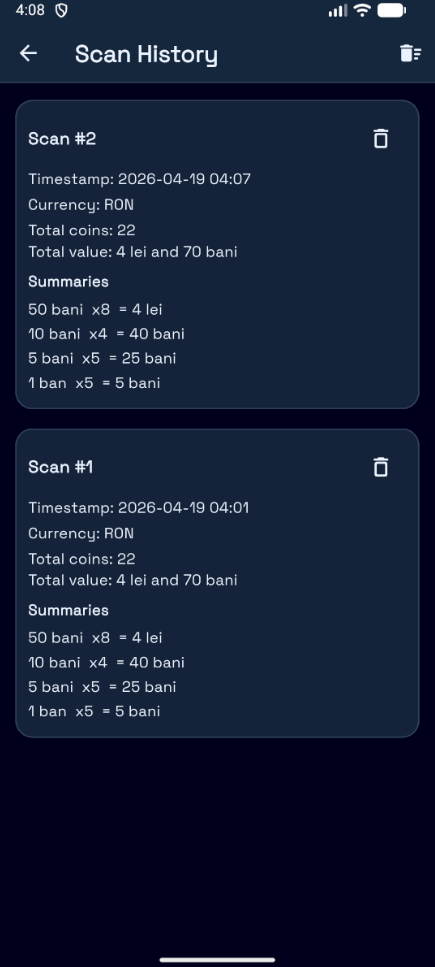
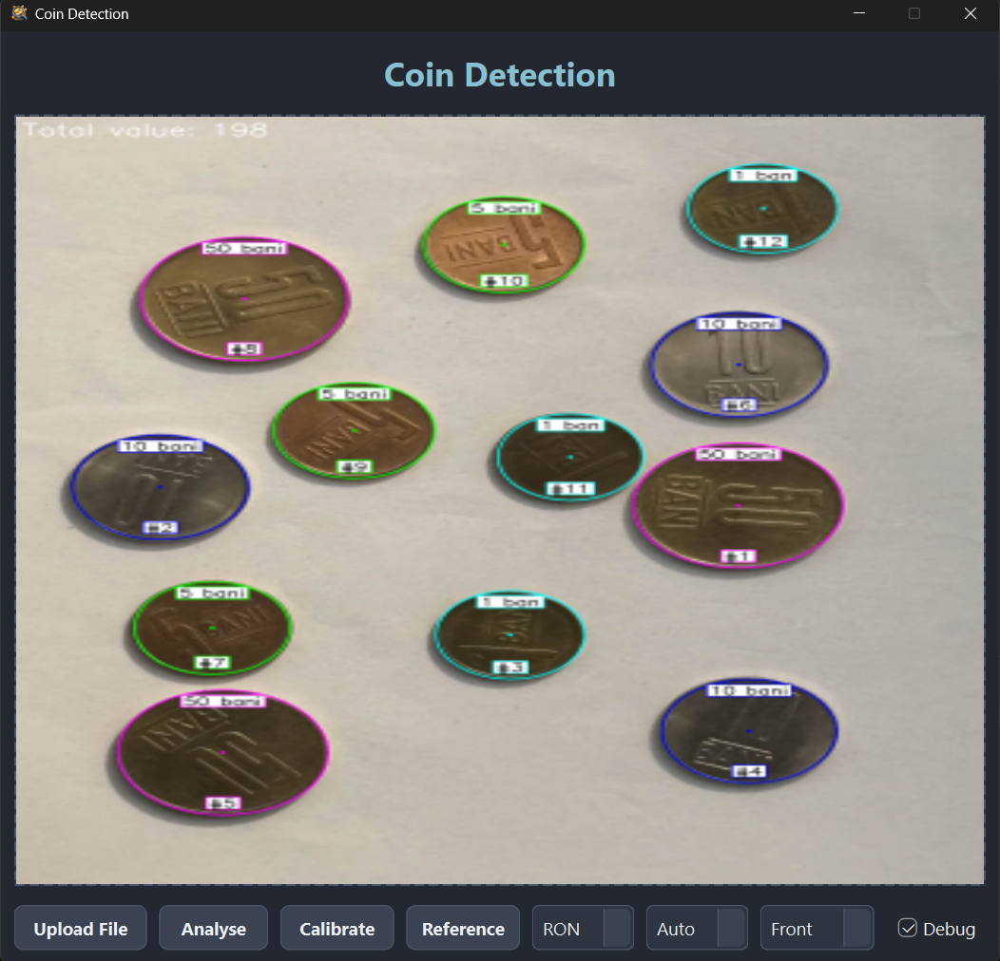

# Coin Detector

Flutter app with FastAPI integration for uploading images and automating coin detection and counting. The backend is an advanced Python computer‑vision system (OpenCV + ORB) and includes a PyQt6 desktop GUI for debugging and visualization.

## Requirements

- Python 3.10+
- Flutter SDK (for mobile/web client)

Install Python dependencies:

```bash
pip install -r requirements.txt
```

## 1) Desktop GUI (PyQt6)

Run the desktop app:

```bash
python src/python/gui/gui.py
```

The GUI provides:

- **Upload File**: Drag & drop or browse to select an image
- **Analyse**: Run coin detection on the selected image
- **Calibrate**: Calibrate using a reference coin (select value from dropdown)
- **Reference**: Save ORB reference image for a coin type (select value from dropdown)
- **Debug**: Enable detailed logging and debug output

### Key Features

- **Multi-coin Detection**: Detects Romanian coins of 1, 5, 10, and 50 bani denominations
- **Real-size Calibration**: Uses actual Romanian coin dimensions (mm) for accurate detection
- **ORB Reference Matching**: Compares detected coins with reference images using ORB descriptors
- **Pixels↔Millimeters Conversion**: Automatic conversion between pixel measurements and real dimensions
- **Scale-independent Detection**: Works accurately regardless of photo distance/height
- **Three-criteria Validation**: ORB matching, overlap checking, and distance analysis
- **Radius Pre-filtering**: Circles are filtered by radius range before validation to improve efficiency
- **Debug Mode**: Comprehensive step-by-step analysis with visual debugging
- **Smart Calibration System**: Single-photo calibration for perfect scale detection
- **Reference Image Management**: Save and manage ORB reference images for each coin type
- **Graphical User Interface**: PyQt6-based GUI for easy interaction
- **Optimized Performance**: Auto-adjusts parameters based on image resolution

## 2) API (FastAPI)

Main endpoint:

- `POST /analyze` (multipart fields: `image`, `auto_mode`, `coin_value?`, `currency_code`, `user_id`)

Security:

- API key header: `X-API-Key`
- Rate limiting by `user_id`

Important environment variables:

- `COIN_COUNTER_API_KEY` (required)
- `COIN_COUNTER_RATE_LIMIT_SECONDS` (optional)
- `COIN_COUNTER_CORS_ORIGINS` (optional)
- `COIN_COUNTER_CORS_ORIGIN_REGEX` (optional)

Run API:

```bash
uvicorn api.app:app --app-dir src --reload
```

Health check:

- `GET /health`

## 3) Flutter App (mobile/web)

Project folder:

- `src/flutter_coin_detector`

Run:

```bash
cd src/flutter_coin_detector
flutter pub get
flutter run
```

API integration notes:

- Sends `user_id` in request body
- Sends API key in `X-API-Key` when provided via `--dart-define`
- Default local API base URL:
	- Web/Desktop: `http://127.0.0.1:8000`
	- Android emulator: `http://10.0.2.2:8000`

Example with defines:

```bash
flutter run --dart-define=COIN_COUNTER_API_KEY=your_key --dart-define=COIN_COUNTER_USER_ID=device_or_user
```

## Example photos
### Android app analysis with multiple photos using Add-More function, using both light and dark themes, including scan history

<table>
	<tr>
		<td align="center"></td>
		<td align="center"></td>
		<td align="center"></td>
	</tr>
	<tr>
		<td align="center" colspan="3">
			
			
		</td>
	</tr>
	<tr>
		<td align="center" colspan="3">
			
			
		</td>
	</tr>
</table>

### Debug GUI analysis
<p align="center">
	
</p>